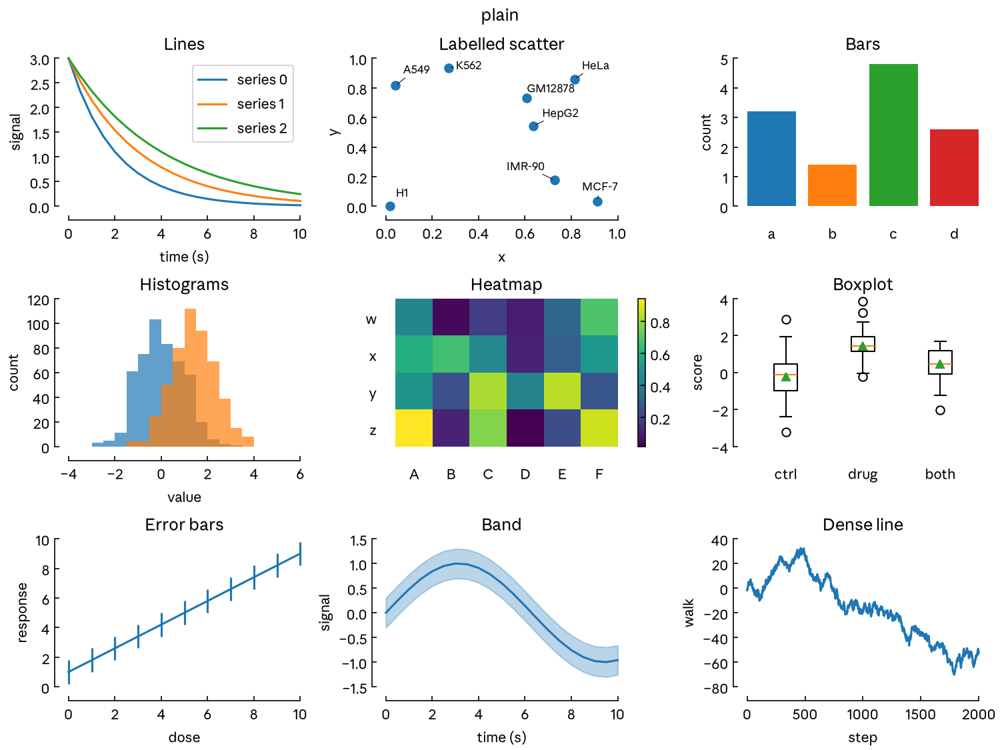
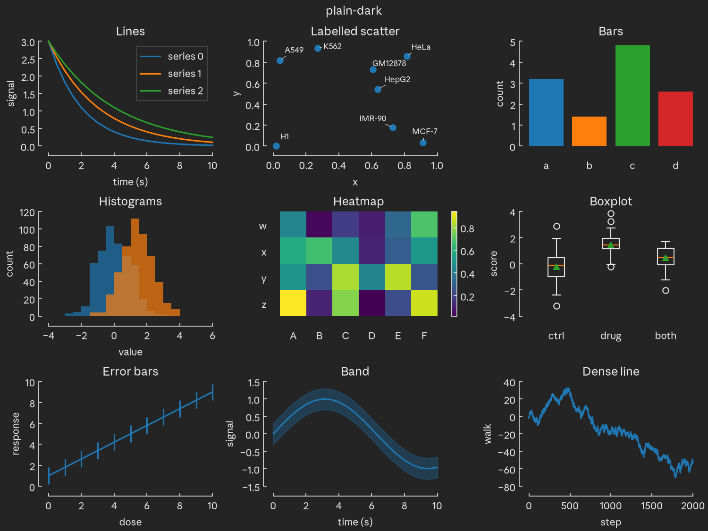
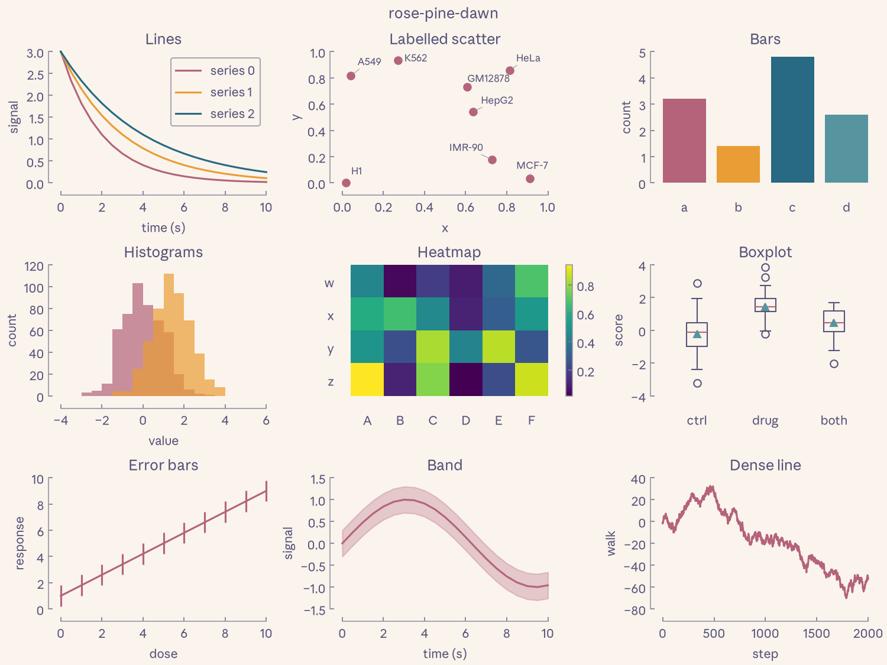
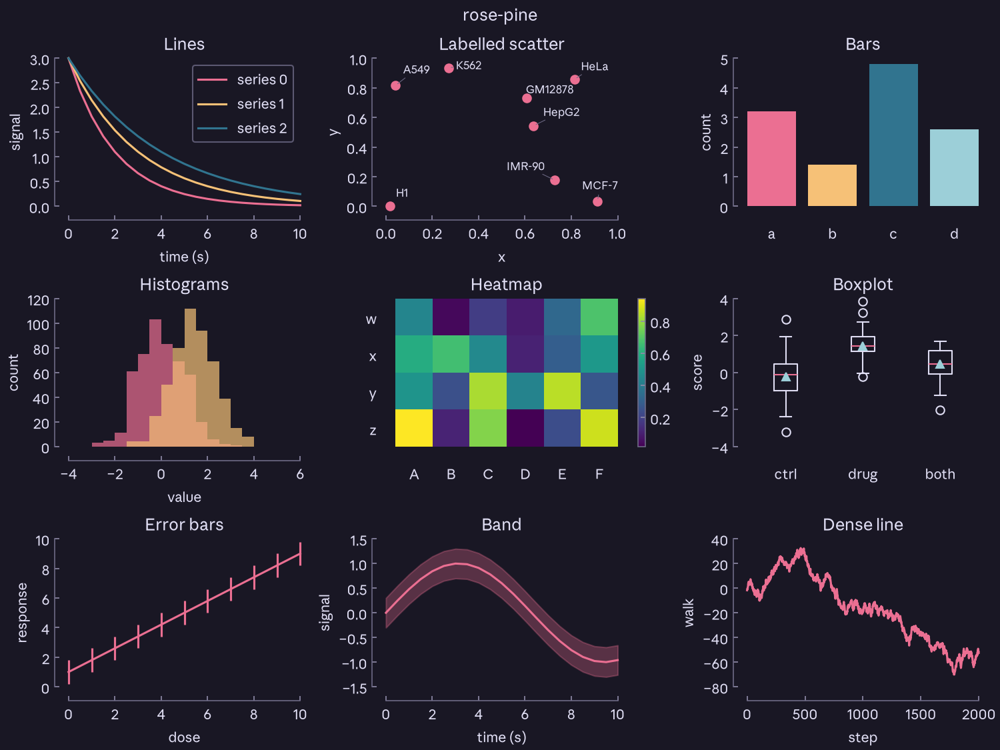
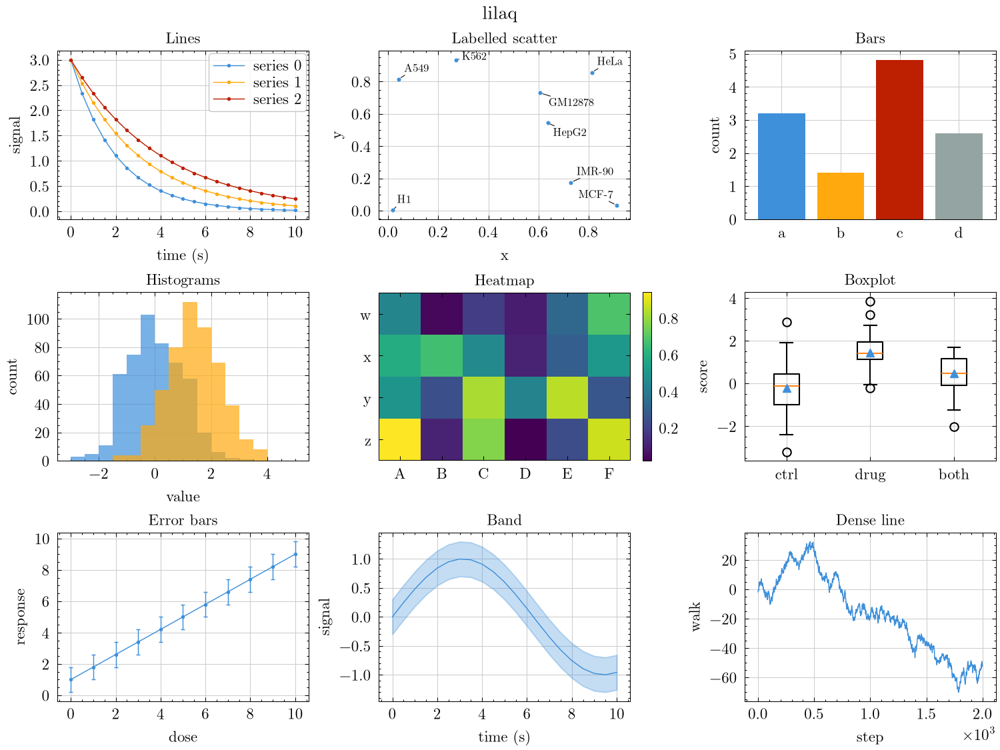
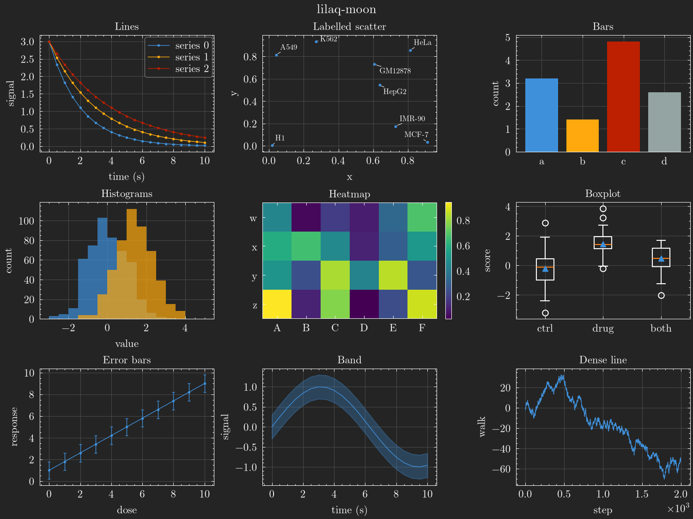

# poikilos

Matplotlib themes, plus three helpers for publication figures. *Poikilos* is
Greek for many-colored.

A theme is a look (fonts, spines, ticks, sizes) plus a palette (colors). Any
look takes any palette.

| Theme | Look | Palette |
| --- | --- | --- |
| `plain`, `plain-dark` | plain | matplotlib's tab10 on white or `#242424` |
| `rose-pine`, `rose-pine-moon`, `rose-pine-dawn` | plain | [Rosé Pine](https://rosepinetheme.com) |
| `lilaq`, `lilaq-moon` | lilaq | [lilaq](https://lilaq.org) 0.6.0, default and moon |

| Light | Dark |
| --- | --- |
|  |  |
|  |  |
|  |  |

[`rose-pine-moon`](assets/gallery/rose-pine-moon.png) is in the same folder.

## Install

```bash
uv add "poikilos @ git+https://github.com/ramirc0/poikilos"
uv add "poikilos[labels] @ git+https://github.com/ramirc0/poikilos"  # adds adjustText for label_points
```

Needs Python 3.11 and matplotlib 3.11 or later.

## Usage

```python
import matplotlib.pyplot as plt

import poikilos as pk

pk.use("rose-pine")

fig, ax = plt.subplots()
ax.plot([0, 1, 2], [0, 1, 0])
pk.despine(ax)
pk.save_figure(fig, "results/plot")  # writes plot.svg and plot.png
```

`use()` resets every style rcParam to matplotlib's default, then applies the
theme. It leaves the backend alone, so it works before or after importing
pyplot. Importing `poikilos` changes nothing.

For one figure in another theme, use `context()`. It restores the previous
rcParams on exit. Save inside the block, because matplotlib reads
`savefig.dpi` at save time.

```python
with pk.context("lilaq"):
    fig, ax = plt.subplots()
    ax.plot(x, y)
    pk.save_figure(fig, "results/lilaq")
```

### Mixing and overrides

`palette=` puts another palette on a theme's look. `rc=` sets any rcParams on
top. `use()`, `context()` and `rc_params()` all take both.

```python
pk.use("lilaq", palette="rose-pine-dawn")  # lilaq look, Rosé Pine Dawn colors
pk.use("plain", rc={"axes.grid": True})
```

`use()` validates everything before it touches matplotlib. A misspelled key in
`rc` raises `KeyError` and a bad value raises `ValueError`. Either way the
current rcParams stay as they were. The next `use()` resets any rcParam you set
by hand, so set them after `use()` or pass them in `rc`.

seaborn's `set_theme()` also resets rcParams. Call it before `pk.use()`.

`pk.rc_params(theme, palette=None)` returns a theme's rcParams as a dict
without applying them.

### Palettes as data

Palettes are TOML files in `src/poikilos/palettes/`. `pk.PALETTES` holds them
with every color resolved to hex:

```python
dawn = pk.PALETTES["rose-pine-dawn"]
dawn.background  # '#faf4ed'
dawn.cycle  # ('#b4637a', '#ea9d34', ...)
dawn.colors["love"]  # '#b4637a', by the palette's own name
```

`pk.THEMES` maps each theme name to its `(look, palette)` pair.

A palette sets root colors only: background, foreground, frame, ticks, grid,
legend edge, boxplot median and mean, and the cycle. Legend face, title,
`savefig` and hatch colors inherit from those. An `rc=` override of a root
color therefore carries through to them.

## Helpers

- `despine(ax, categorical_x=False, categorical_y=False)` fits each continuous
  axis to its data and widens it to the enclosing ticks. It then offsets the
  left and bottom spines by 10 pt and trims them to the end ticks. The top and
  right spines and their ticks go. Pass `categorical_x=True` for bar charts,
  `categorical_y=True` for horizontal bars, and both for heatmaps. Call it after
  everything is drawn.
- `label_points(ax, points, labels, **text_kwargs)` labels the collection
  `ax.scatter` returns. It moves labels off each other and off the markers,
  but a label can still touch a marker. That happens most near the edge of the
  axes, since labels stay inside them. Call it last, after `despine` and every
  title and legend. Needs the `labels` extra.
- `save_figure(fig, path, **savefig_kwargs)` writes `path.svg` and `path.png`.
  It drops a `.svg` or `.png` suffix and keeps any other dots, so `x.curve`
  gives `x.curve.svg` and `x.curve.png`.

## Recipes per look

Looks only set rcParams. Anything that needs code per axes is a recipe.

**plain.** Call `despine` on every axes. Without it you get matplotlib's
default frame minus the top and right spines.

**lilaq.** lilaq's tick steps and dotted lines take a few lines of code:

```python
from matplotlib.ticker import MaxNLocator, NullLocator

ax.plot(x, y, marker="o")  # lilaq draws a dot at every data point
for axis in (ax.xaxis, ax.yaxis):
    axis.set_major_locator(MaxNLocator(7, steps=[1, 2, 5, 10]))
ax.xaxis.set_minor_locator(NullLocator())  # instead, on a categorical axis
```

lilaq rounds the step to 1, 2 or 5 and scales the tick count with the axis
length. That gives about five ticks on its default 6 × 4 cm plot, where
`nbins=7` switches steps at nearly the same data ranges. On axes of another
size, lilaq picks a different count. The dots stay out of the look
on purpose. A `marker` in `axes.prop_cycle` makes `plot(color="k")` use up a
cycle slot and beads dense lines. seaborn would also apply it unevenly.
`scatterplot` and `pointplot` drop it. `lineplot` keeps it but leaves it out of
the legend, and without `hue` takes the marker from the wrong cycle slot.

**PDF text as TrueType.** `rc={"pdf.fonttype": 42}` embeds fonts as TrueType.
Use it only with a TrueType font. Anthropic Sans Text and New Computer Modern
are CFF (`.otf`) fonts, which a Type 42 stream cannot hold.

## Fonts

No fonts ship with poikilos. Each look names a fallback chain that ends in a
DejaVu family bundled with matplotlib, so a missing font falls back silently.

- plain: Anthropic Sans Text, Google Sans Flex, Arimo, Arial, DejaVu Sans.
- lilaq: New Computer Modern, then DejaVu Serif. Math uses matplotlib's bundled
  Computer Modern.

matplotlib knows New Computer Modern as `NewComputerModern`. From
[CTAN](https://ctan.org/pkg/newcomputermodern), install only the 10 pt cuts
Typst uses: `NewCM10-Regular.otf`, `NewCM10-Italic.otf`, `NewCM10-Bold.otf`,
`NewCM10-BoldItalic.otf` and `NewCMMath-Regular.otf`. The 8 pt and Book cuts
register under the same family and weight, and matplotlib may pick any of them.

After installing a font, delete matplotlib's font cache so it rescans:

```bash
rm "$(python -c 'import matplotlib; print(matplotlib.get_cachedir())')"/fontlist-*.json
```

Check that a family resolves without falling back:

```python
from matplotlib.font_manager import FontProperties, findfont

findfont(FontProperties(family="NewComputerModern"), fallback_to_default=False)
```

The themes set `svg.fonttype: none`, so an SVG names its font instead of
embedding it. A viewer without the font shows a substitute. PNGs look the same
everywhere.

## Limits

- matplotlib hard-codes the colors of `table` cells, `quiver`, `barbs` and
  `spy`. Palettes do not reach them.
- rcParams cannot fix the size of the data area. The lilaq look's figure size
  gives about lilaq's 6 × 4 cm for a plot with a title and both axis labels.
- matplotlib's `scatter` draws from its own color cycle, separate from `plot`.
- Some cycle colors have under 3:1 contrast with their background, such as two
  petroff10 colors on `lilaq-moon`. `scripts/gallery.py` prints the ratios.
  Text has at least 4.5:1 in every palette, and a test checks it.

## Development

```bash
uv sync
uv run pytest                          # includes image tests against tests/baseline/3.11
uv run ruff check && uv run ruff format --check
uv run python scripts/gallery.py       # regenerate assets/gallery
uv run python scripts/lilaq_parity.py  # compare with lilaq 0.6.0 in build/parity
```

[CHANGELOG.md](CHANGELOG.md) has the version history and the versioning rules.

## License

MIT (see `LICENSE`).
