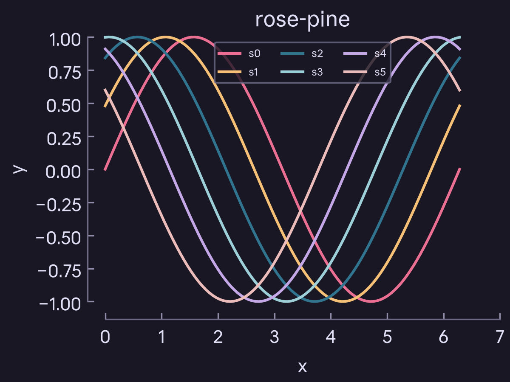

# matplotlib-rosepine

[Rosé Pine](https://rosepinetheme.com) styles for matplotlib, in all three
variants (`rose-pine`, `rose-pine-moon`, `rose-pine-dawn`).



## Install

```bash
uv add matplotlib-rosepine        # or: uv pip install matplotlib-rosepine
uv add "matplotlib-rosepine[labels]"   # adds adjustText for label_points()
```

From a local checkout:

```bash
uv pip install .
```

## Usage

```python
import matplotlib_rosepine as rp
rp.apply_style("rose-pine")       # rose-pine | rose-pine-moon | rose-pine-dawn

import matplotlib.pyplot as plt
fig, ax = plt.subplots()
ax.plot([0, 1, 2], [0, 1, 0])
rp.despine(ax)
rp.save_figure(fig, "plot")      # writes plot.svg and plot.png
```

`apply_style()` sets the Agg backend and applies the style, so it MUST run
before `matplotlib.pyplot` is imported. The style removes the top and right
spines and points ticks inward. Importing the package alone registers every
style, so you can select one by name instead:

```python
import matplotlib_rosepine        # noqa: F401  (registers styles)
import matplotlib.pyplot as plt
plt.style.use("rose-pine-moon")
```

### Helpers

- `despine(ax, categorical_x=False, categorical_y=False)`: call after drawing.
  Fits each continuous axis to its data, widens it to the enclosing ticks, and
  offsets the left and bottom spines by 10 pt, trimmed to the end ticks. Pass
  `categorical_x=True` for bar charts, `categorical_y=True` for horizontal bars,
  both for heatmaps.
- `save_figure(fig, path)`: writes `path.svg` and `path.png`.
- `label_points(ax, points, labels, **text_kwargs)`: labels the collection
  `ax.scatter` returns without overlaps. Call last on the figure. Needs the
  `labels` extra.
- `VARIANTS`, `style_path(variant)`, `register()`.

### Fonts

No font ships with the package. Matplotlib uses the first installed family
from: Anthropic Sans Text, Google Sans Flex, Arimo, Arial, DejaVu Sans.

The styles use `svg.fonttype: none`, so SVGs reference the font by name rather
than embedding it; a viewer needs the same font installed to render it. PNGs
embed the glyphs and always render correctly.

## Development

Styles are generated from matplotlib's default rc with
[rose-pine-bloom](https://github.com/rose-pine/rose-pine-bloom):

```bash
python scripts/build_template.py   # default rc -> template.mplstyle
rose-pine-bloom -t template.mplstyle -o src/matplotlib_rosepine/styles -f hex-ns
python scripts/preview.py          # regenerate assets/preview-*.{svg,png}
uv run pytest
```

`-f hex-ns` is required: matplotlib only honors `#` inside double quotes, so
`prop_cycle` needs bare hex.

## License

MIT (see `LICENSE`).
